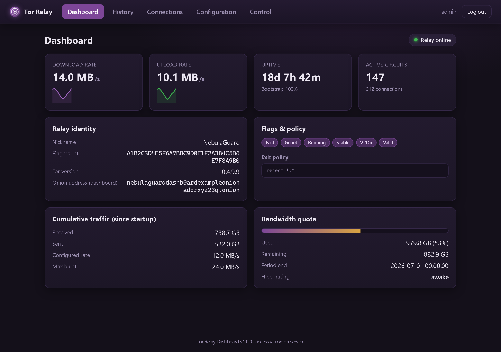
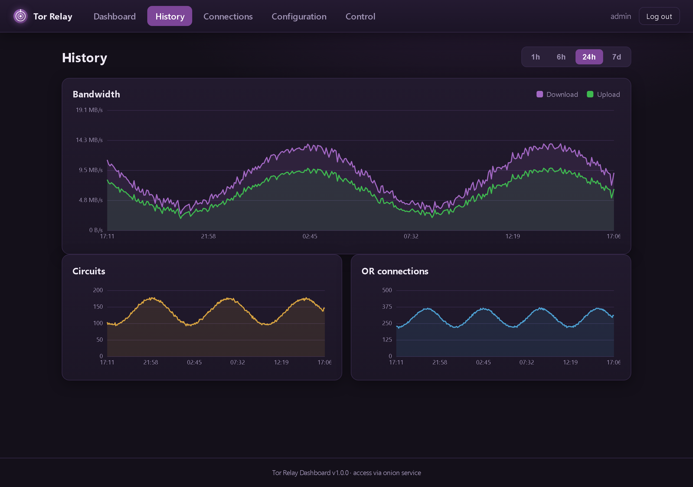
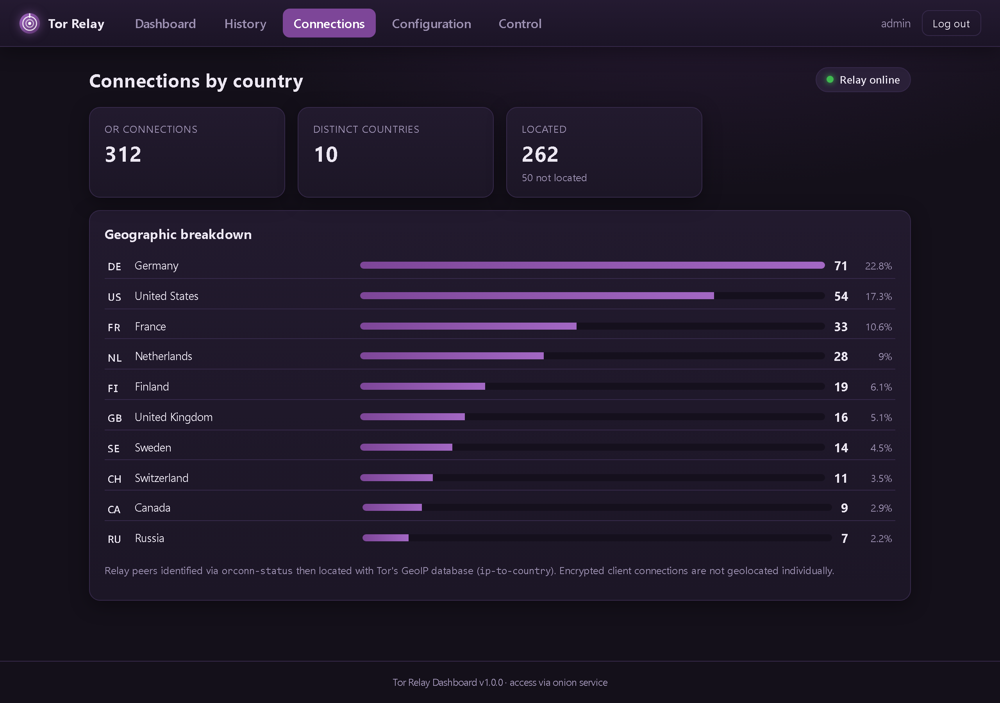
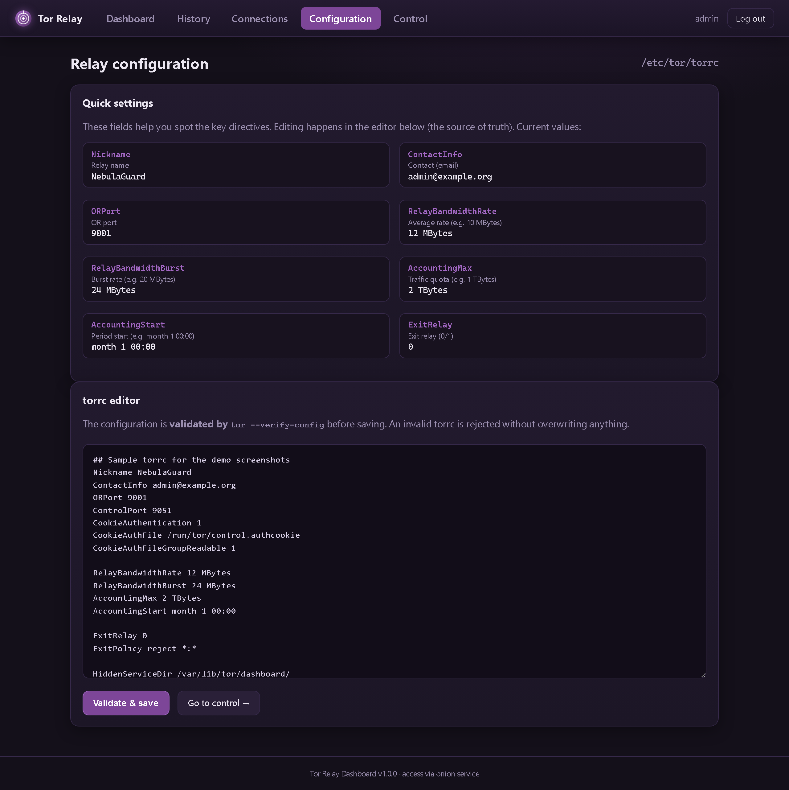
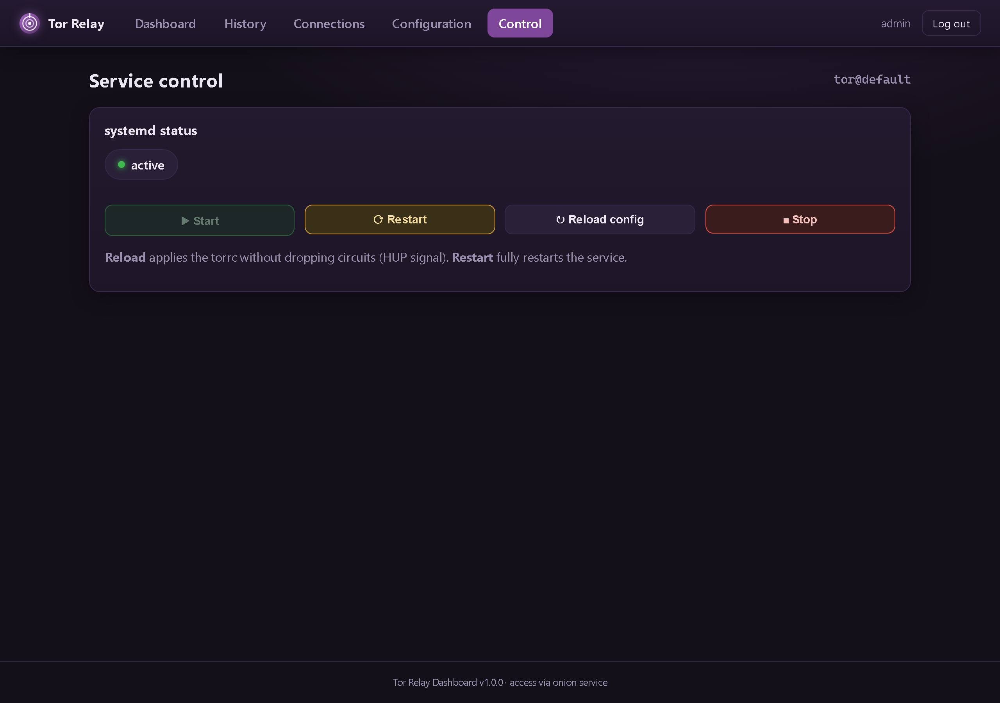

# Tor Relay Dashboard

[](LICENSE)


Web dashboard to manage a **personal Tor relay** hosted on a Debian/Ubuntu VM.
It displays the relay metrics, lets you edit its configuration (`torrc`), and
start / stop / restart it — all behind strong authentication and reachable
**outside the LAN through an onion service** (no port open on the Internet).

## Screenshots

> Demo data — a real relay populates these views through the ControlPort.



| History | Connections by country |
|---------|------------------------|
|  |  |
| **Configuration** | **Control** |
|  |  |

## Features

- **Real-time metrics**: upload/download rates (sparklines), cumulative
  traffic, uptime, bootstrap %, circuits & connections, consensus flags
  (Guard/Fast/Stable/Exit…), exit policy, bandwidth accounting
  (`AccountingMax`), identity (nickname, fingerprint, version), the dashboard
  `.onion` address.
- **Persistent history**: background sampling (SQLite) of rates, circuits and
  connections, with charts over 1h / 6h / 24h / 7d (configurable retention).
  Survives dashboard restarts.
- **Connections by country**: geographic breakdown of relay peers, resolved
  through the ControlPort (`orconn-status` → consensus → Tor's GeoIP database),
  with no access to system sockets.
- **Configuration editing**: `torrc` editor with **`tor --verify-config`
  validation before writing** (an invalid file is rejected without overwriting
  anything) plus a view of the key directives.
- **Service control**: start / stop / restart / reload via `systemctl`, with
  live systemd status.
- **Security**: username + password (bcrypt) + **TOTP 2FA**, signed sessions,
  exposure through an **onion service v3**, elevated privileges confined to a
  single root helper (restricted sudoers).
- **Automatic start** on VM boot, **after** the Tor relay
  (`After=`/`Requires=tor.service`).

## Architecture

```
Browser (Tor Browser)
        │  http://xxxxxxxx.onion
        ▼
   Tor daemon  ──HiddenServicePort──►  127.0.0.1:8080  (uvicorn / FastAPI)
        ▲                                   │
        │ ControlPort 9051 (metrics)        │ sudo  ┌───────────────────────┐
        └───────────────────────────────────┴──────►│ tor-dashboard-helper  │
                                                     │ start/stop/.../torrc  │ (root)
                                                     └───────────────────────┘
```

| Component | Role |
|-----------|------|
| `app/tor_controller.py` | Read metrics + connections by country (stem) |
| `app/history.py`        | Persistent history (SQLite) + sampling |
| `app/countries.py`      | ISO country codes → FR name + flag emoji |
| `app/system_control.py` | Calls to the privileged helper (sudo) |
| `app/torrc_manager.py`  | Read/parse the `torrc` |
| `app/auth.py`           | bcrypt password + TOTP + sessions |
| `app/main.py`           | FastAPI routes + pages + sampling task |
| `deploy/`               | Helper, systemd unit, sudoers, torrc example |
| `scripts/`              | `install.sh`, `manage.py` (accounts) |

## Installation (on the VM)

```bash
git clone <repo> tor-dashboard && cd tor-dashboard
sudo ./scripts/install.sh
```

Then follow the 4 steps printed at the end of the installation:

1. **Enable ControlPort + onion service** — append `deploy/torrc.example` to
   `/etc/tor/torrc` (adapting the relay directives), then
   `sudo systemctl restart tor@default`.
2. **Create an account**:
   ```bash
   sudo -u tordash /opt/tor-dashboard/.venv/bin/python \
        /opt/tor-dashboard/scripts/manage.py useradd admin
   ```
   Scan the printed TOTP QR code (Aegis, Google Authenticator…).
3. **Start**: `sudo systemctl start tor-dashboard`.
4. **Get the onion address**:
   `sudo cat /var/lib/tor/dashboard/hostname` → open it in Tor Browser.

## Local development (Windows/Linux)

> Actually controlling a relay requires the VM. Locally you can launch the
> interface; the metrics will stay "offline" without a reachable ControlPort.

```bash
python -m venv .venv
.venv\Scripts\activate          # PowerShell: .venv\Scripts\Activate.ps1
pip install -r requirements.txt
copy .env.example .env          # edit SECRET_KEY
python scripts\manage.py useradd admin
uvicorn app.main:app --reload --port 8080
```

Open http://127.0.0.1:8080/.

## Security notes

- The dashboard only listens on `127.0.0.1`. Remote access goes
  **exclusively** through the onion service: nothing is exposed on the public
  IP.
- Privileged actions (systemctl, writing the torrc) are **never** executed
  directly by the web service: they go through `tor-dashboard-helper`, the only
  binary allowed in sudoers, with fixed sub-commands.
- `.env` and `users.json` (hash + TOTP secret) are mode `600`, owned by
  `tordash`, and excluded from Git.
- Keep the TOTP secret shown at account creation safe (it cannot be recovered
  afterwards; recreate the account if lost).

## Account management

```bash
manage.py useradd <name>   # create an account + TOTP secret (QR)
manage.py passwd  <name>   # change the password
manage.py list             # list accounts
manage.py delete  <name>   # delete an account
```

## License

Distributed under the **MIT** license — see [LICENSE](LICENSE). Provided as is,
without warranty. You are free to use, modify and redistribute it.
